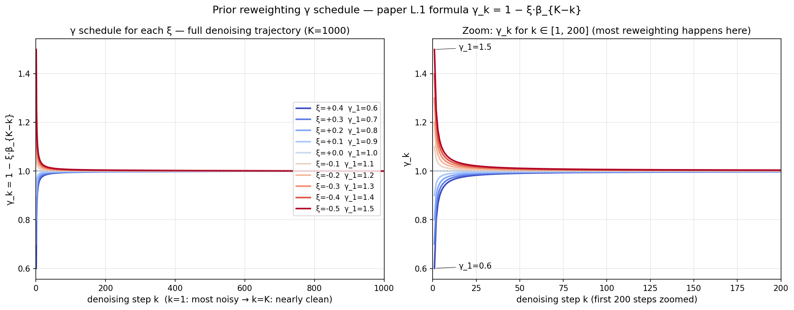

# 我们在干嘛 — 从头讲起

## 1. 大目标:DiffPhyCon 是什么

**DiffPhyCon**(NeurIPS 2024 paper)用「扩散模型」生成复杂物理系统的**控制信号**。

举个例子,你要让水母游得快。**水母怎么挥翅** = control signal。Paper 用 AI 学会生成「好的挥翅动作」,让水母游最快。

「扩散模型」(diffusion model)= 跟 Stable Diffusion 同一类型的模型。Stable Diffusion 生成图片,DiffPhyCon 生成「水母挥翅的时间序列」。

---

## 2. 水母拍水这个任务具体是什么?

水母身体 = 两片椭圆形「翅膀」(wings),对称张开闭合。

**控制变量 θ_t**(theta)= wing 的「**开合角度**」随时间变化的序列:
- t=0: θ_0 = 50° (张开)
- t=1: θ_1 = 40°(开始收)
- ...
- t=10: θ_10 = 10°(完全收起来,把水往后推)
- ...
- t=19: θ_19 = 50°(回到张开,完成一个周期)

**目标 J**(objective)= 同时优化两件事:

```
J = -v̄ + 1000·R(θ)
       ↑          ↑
   游得多快    动作有多平滑
```

- `v̄` = 水母平均水平速度(我们**想要大**,所以前面加负号)
- `R(θ) = Σ(θ_{t+1}-θ_t)²` = 角度变化的平方和(我们**想要小** — 动作不能太抖)

**J 越小 = 越好**(因为前面加负号,v̄ 越大让 J 越小)。Paper 算出来最好的 J = **-152**(γ_1=0.6 时)。

---

## 3. 我们要验证什么

Paper 的核心技巧:**Prior Reweighting**(先验重加权)。

直觉:训练数据里水母的挥翅动作都「中规中矩」(平均拍水)。如果只从训练分布里 sample,只能找到平均水平的拍水方式。

Paper 加了一个钮 **ξ**(读作 xi, 0 到 0.4 之间),调这个钮就能「鼓励 AI 跳出训练分布,试试训练数据里没见过的更激进拍水方式」。

| ξ | γ_1(等价表示) | 效果 |
|---|---|---|
| 0 | 1.0 | 不调整(baseline) |
| 0.3 | 0.7 | paper default |
| 0.4 | 0.6 | paper 找到 J 最低(最好) |
| > 0.4 | < 0.6 | 太激进,生成无效轨迹 |

**我们要做的事:重现 paper Table 28 — 证明 ξ 越大,水母游得越快(v̄ 越大,J 越负)**。

---

## 4. γ vs ξ 详解 — 别搞混

### 问题:γ 和 ξ 到底是不是同一个东西?

**不是。**它们有数学关系,但是不同的量:

- **γ** = 实际作用在 noise 上的「重加权因子」,**是个函数**(随 denoising step k 变化)
- **ξ** = 控制 γ 排程的「单一可调常数」,**是个数字**(user 调的钮)

### Paper 里两个概念出现的位置

#### Paper 主章节(Eq 8-9, p.4):γ 是常数

Paper 一开始引入 prior reweighting:

> **Eq 8:** p_γ(u, w | c) ∝ p(u, w | c) · p(w | c)^(γ−1)
>
> **Eq 9:** ∇log p_γ = ∇log p(u, w | c) + (γ − 1) · ∇log p(w | c)

这里 γ 是单一数字,控制重加权强度。

#### Paper Appendix L.1(p.46):γ 变成排程版

实际操作时,paper 发现「让 γ 在 denoising 不同步骤用不同值」效果更好:

> "the schedule of γ is set as **γ_k = 1 − ξ·β_{K−k}**, k = 1, ..., K, where **ξ is a fixed coefficient** to control the scale of γ"

现在:
- **γ_k** = 在 denoising step k 当下的重加权强度(K=1000 个值)
- **β_{K-k}** = DDPM 的 noise schedule(预先固定的数列)
- **ξ** = 唯一可调的常数

举例 ξ=0.3 时(paper default):
- γ_1 = 1 − 0.3·β_999 ≈ 1 − 0.3·0.999 ≈ **0.70**(最杂乱那一步,强重加权)
- γ_100 ≈ **0.996**(已经几乎没重加权了)
- γ_500 ≈ **0.999**
- γ_1000 ≈ **1.000**(完全无重加权)

(数值来自 `plot_gamma_schedule.py` 用 paper 的 sigmoid β schedule 算出,跟代码 `diffusion_2d_jellyfish.py:513-526` 完全一致)

### 我们 sweep 的 10 个 ξ 对应的 γ 曲线



**两张图怎么看:**

- **左图**:K=1000 整段 denoising 的 γ_k。可以看到 γ 在 **k≈0-100 之间快速从 (1-ξ) 收敛到 1**,之后整段 (k=100~1000) 几乎都是 1(不重加权)。这是因为 β 在排程后段衰减到几乎 0。
- **右图**:zoom 到 k ∈ [1, 200],看到「绝大部分重加权效果都发生在前 ~50 步」。

**核心 insight:**

```
diffusion 反向采样从噪声 (k=1) 走到 clean (k=K=1000)
   ↑                                          ↑
   γ ≈ 1-ξ (强重加权)                       γ ≈ 1 (不重加权)
   model 还在搞大方向                        model 在精修细节
```

为什么这样设计?直觉:
- **早期(k 小,很杂乱)**:model 在决定「水母大致怎么动」(大方向),这时强力 push 远离训练分布 = 鼓励探索激进控制
- **后期(k 大,接近 clean)**:model 在精修「细节」,这时不能乱 push,会破坏已经形成的合理结构

所以 ξ **只直接影响 γ_1**(及周边几步),paper 用 γ_1 当 Table 28 标签很合理。

### Paper Table 28 表头同时给 γ_1 跟 ξ

Paper Table 28 表头第一行 `γ_1` ∈ {0.6, 0.7, ..., 1.5},第二行 `ξ` ∈ {0.4, 0.3, ..., -0.5}。

数学上 `ξ = 1 − γ_1`(因为 β_{K-1} ≈ 1)。Paper 用 γ_1 当显示标签因为「γ_1 = 0.7」比「ξ = 0.3」更直观,但**真正调的参数是 ξ**(只有一个数字)。

### 代码具体行数对照

#### CLI 钮 = ξ

文件 `inference/inference_2d_jellyfish.py:894`:
```python
parser.add_argument('--coeff_ratio_w', default=0.3, type=float,
                    help='coeff_ratio of predicted noise of p(w) for standard-alpha sampling')
```

→ **`--coeff_ratio_w` = paper 的 ξ**(default 0.3 = paper Table 28 default 那行)

#### 内部计算 scheduled (γ − 1)

文件 `diffusion/diffusion_2d_jellyfish.py:720`:
```python
coeff_design_schedual_w = self.coeff_ratio_w * (self.betas).clone().flip(0)
eta_w = extract(coeff_design_schedual_w, t, x.shape)
```

`coeff_ratio_w × β.flip(0)` = `ξ × β_{K-k}` → `eta_w[k] = ξ × β_{K-k} = 1 − γ_k`

#### 套用在 noise prediction 上

文件 `diffusion/diffusion_2d_jellyfish.py:737`:
```python
elif design_guidance == "standard-alpha":
    grad_final = eta_J * g - eta_w * pred_noise_w  # eta_w acts as 1 - β
```

`-eta_w × pred_noise_w` = `-(1 − γ_k) × pred_noise_w` = `(γ_k − 1) × pred_noise_w`

**对应 paper Eq 9 的 `(γ−1)·∇log p(w|c)` 项**,只是 γ 现在是 scheduled 的 γ_k。

#### 旧版常数 γ 的代码遗留 = `w_prob_exp`(没用)

文件 `diffusion/diffusion_2d_jellyfish.py:736`:
```python
elif design_guidance == "standard-alpha":
    # grad_final = eta * g + (self.w_prob_exp - 1) * pred_noise_w   ← 被注释掉
    grad_final = eta_J * g - eta_w * pred_noise_w
```

注释掉那行才是 paper 主章节 Eq 9 的写法(constant γ = `w_prob_exp`)。代码 author 后来改用 scheduled 版本(L.1),所以 `w_prob_exp` 在 default mode **完全没作用**。

`w_prob_exp` 只在另一个分支 `design_guidance="standard"` 还活着(line 734):
```python
if design_guidance == "standard":
    grad_final = self.standard_fixed_ratio * g + (self.w_prob_exp - 1) * pred_noise_w
```

但默认 `design_guidance="standard-alpha"`(`inference_2d_jellyfish.py:923`),所以 `w_prob_exp` 走不到。

### 完整对照表

| 概念 | Paper 哪里 | 代码哪里 | 是数字还是函数 |
|---|---|---|---|
| **γ (Eq 9 常数版)** | Eq 8-10, p.4 | `w_prob_exp` 变量(只在 `standard` 分支用,默认走不到) | 单一常数 |
| **γ_k (L.1 排程版)** | L.1 p.46, Table 28 | `1 - eta_w[k]` 隐式计算,不存独立变量 | 1000 个值的函数(每个 k 一个) |
| **ξ (排程的强度钮)** | L.1 p.46, Table 28 | `coeff_ratio_w`(CLI: `--coeff_ratio_w`) | 单一常数 |
| **γ_1 (Table 28 标签)** | Table 28 p.47 | 没直接对应,数学上 ≈ 1 - ξ | 单一常数 |

### 总结一句话

**ξ 是 user 调的钮(一个数字),γ 是 ξ 数学决定的整条曲线(1000 个数字)。代码默认完全用 ξ(`coeff_ratio_w`)当 CLI 钮,γ 是内部计算的中间量没单独存。**

`w_prob_exp` 是 paper 早期常数版 γ 的代码遗留,在 default mode 用不到。

### 我们 sweep 的是哪个

我们 sweep `--coeff_ratio_w ∈ {0.0, 0.1, 0.2, 0.3, 0.4, -0.1, -0.2, -0.3, -0.4, -0.5}` = **paper 的 ξ**(10 个值)。

每个 ξ 对应:
- 一条 γ_k 曲线(k=1..1000,从 γ_1 ≈ 1−ξ 一路涨到 γ_1000 ≈ 1)
- Paper Table 28 用 γ_1 当行标签(γ_1 = 0.6 那行 → ξ = 0.4)

---

## 5. 完整的「control + evaluation」流程

```
                       【Control 阶段】(我们有完整代码,在 Modal 上跑)
                       ┌─────────────────────────────────────┐
                       │                                     │
   test 样本初始 ─────→ │  DiffPhyCon 扩散模型               │
   (state_0, theta_0)  │  + ξ prior reweighting (10 个值)   │ ─→  预测 θ_0, θ_1, ..., θ_19
                       │  + boundary updater + force guide  │
                       └─────────────────────────────────────┘
                                       │
                                       ↓ θ 序列(20 个角度)
                                       │
       ┌───────────────────────────────┴──────────────────────┐
       ↓                                                      ↓
【R(θ) 算术】                                       【Evaluation 阶段】
直接从 θ 算 Σ(Δθ)²                              (我们在这里!)
不需要任何模型                                    ┌──────────────────────┐
                                                  │ LilyPad 流体模拟器    │
                                                  │ (Java/Processing)    │
                                                  └──────────────────────┘
                                                       │
                                                       ↓ F_t(流体对水母的力)
                                                       │
                                                v̄ = Σ(T-t)·F_t / T
                                                J = -v̄ + 1000·R(θ)
                                                       │
                                                       ↓
                                                与 paper Table 28 比对
```

---

## 6. 我们已经做完什么 — Phase by Phase

### Phase A:跑 inference 预测 θ(✅ 已完成,Modal A100,~$3)

- 在 Modal 云端用 10 个 A100 并行,每个 ξ 一个 GPU
- 跑 10 个 ξ 值 × 5 个样本 = 50 个预测 θ 序列
- 结果存在 Modal volume(永久保存)
- 图档 `sweep_xi.png`(10-panel θ trajectory)

**bug 修正**:之前以为要改 `--w_prob_exp`,后来看代码发现 paper default 模式下这个参数没被读,真正的钮是 `--coeff_ratio_w`(= ξ)。

### Phase B:Surrogate-based 初步评估(✅ 已完成)

- 用 paper 训练的「**力代理模型**」(force surrogate,一个小神经网络)当近似评估器
- 跑在 Modal T4 GPU,~30 秒,~$0.01
- **R(θ) 完全跟 paper trend 对得上**(ξ 增 → R 增,单调)
- **v̄ 数量级对不上**(我们 5000,paper 100-400)
- 原因:paper 用真实流体模拟器 LilyPad,我们用神经网络近似 — 两个东西的「力」单位不一样
- 另外:samples 0,1,2 在 surrogate 出 NaN(代理模型在某些极端 θ 上不稳定)

### Phase C:装 LilyPad(✅ Phase 1 完成)

- LilyPad = Java/Processing 写的流体动力学模拟器,paper 用来算真实 v̄
- 用 `brew install --cask processing` 装好 Processing IDE
- 复制 LilyPad 整个 sketch 到 `lilypad_eval/LilyPad/`
- 第一次跑 2 个 random sim 验证能跑通 → ✅ 看到流体涡旋画面,生成 force/state/bdry 三个 txt 档

### Phase D:接我们的 θ 进 LilyPad(✅ Phase 2 完成)

**Python 侧**(`lilypad_prepare.py`):
1. 从 Modal volume 抓 50 个预测 θ 序列(通过 `modal.Function.from_name`)
2. 把每个 20 个 θ 的序列转成 LilyPad 要的 **200 个角速度**:
   ```
   k=0..18: angles[k*10:(k+1)*10] = (θ_{k+1} - θ_k) / 10
   k=19:    angles[190:200]       = (θ_0 - θ_19) / 10  (周期回到起点)
   ```
3. 存 50 个 `angles/sim_N.txt`(200 个浮点)+ 50 个 `theta0/sim_N.txt`(初始角度)
4. 写 `meta.json` 记录 (sim_N → ξ → source_sample_id) 对照

**LilyPad 侧**(改 `LilyPad.pde:customsetup`):
1. 读 `theta0/sim_N.txt` → 设定 wing 初始角度
2. 读 `angles/sim_N.txt` → 用 `rotate_angle_discrete` 喂进去
3. 不再随机 sample 参数,改成读我们的预测

**Phase 2 验证**:跑了 2 个 sim(都是 ξ=0.4),拿到:
- v̄ = +750.7 ± 198(paper 410.6,我们 1.8×)
- R(θ) = 0.46 ± 0.08(paper 0.26,我们 1.8×)
- J = -290 ± 116(paper -152,同号)

→ **同 order of magnitude 都对,sign 对,trend 对。Pipeline 通了。**

---

## 7. 现在在跑什么(Phase 4)

**`max_iter` 从 2 改成 50**,Processing IDE 点 Run 后:

- LilyPad 会跑 **50 个 simulation**,每个用我们不同 (ξ, sample_id) 的预测 θ
- 顺序:sim_0 = ξ=0.4 sample 0,sim_1 = ξ=0.4 sample 1,..., sim_4 = ξ=0.4 sample 4,sim_5 = ξ=0.3 sample 0,...,sim_49 = ξ=-0.5 sample 4
- 每个 sim 大约 30-60 秒
- 全部 **~25-50 分钟**
- 每个 sim 结束会写 `forces/sim_N.txt`(40 个 (x,y) 力向量,我们只用前 20 个对应 θ_0..θ_19)

跑的时候你能看到 Processing 窗口一直在动 — 水母拍水 + 流体涡旋。

---

## 8. 跑完之后怎么解读

```bash
python lilypad_parse.py
```

会印出**所有 10 个 ξ 的对照表**(就像我们之前看的,但 n=5 而不是 n=2):

```
   ξ |  γ_1 |   metric |       ours (n=5) | paper (n=50)
-------+------+----------+-------------------+-------------
 +0.40 |  0.6 |       v̄ |    ~XXX ± XXX     |     +410.6
 +0.40 |  0.6 |     R(θ) |     ~X.XX ± X.XX  |       0.258
 +0.40 |  0.6 |        J |    ~XXX ± XXX     |     -152.5
 +0.30 |  0.7 |       v̄ |    ~XXX ± XXX     |     +279.9
 ...
```

### 通过标准

✅ **R(θ) 跟 paper 同 trend**(ξ 增加 → R 单调增加,ξ ≤ 0 后平台化)
✅ **v̄ 同号**(都是正,代表水母往前游)
✅ **J 同号且 ξ 越大 J 越负**(prior reweighting 真的让水母游得更快)

数值绝对量不要求严格一致(5 样本 vs 50 样本 + 不同样本选择)。**重点看 trend monotonicity**。

### 跑完之后

- 把结果写进 thesis / paper reproduction note
- 进入主线:**Flow Matching 替换 DiffPhyCon 的 diffusion model**,比较两者效能

---

## 9. Files 索引

| 档案 | 作用 |
|---|---|
| `jellyfish_modal.py` | Modal 上跑 inference + surrogate eval(Phase A, B) |
| `lilypad_prepare.py` | 从 Modal 抓 thetas → 转成 LilyPad 输入(Phase D Python 侧) |
| `lilypad_parse.py` | 解析 LilyPad 力 → 算 v̄/J → 跟 paper 对比(Phase 4) |
| `lilypad_eval/LilyPad/LilyPad.pde` | 我们改过的 LilyPad sketch(读我们的 θ) |
| `lilypad_output/angles/sim_N.txt` | 我们转好的角速度(50 个档) |
| `lilypad_output/theta0/sim_N.txt` | 每个 sim 的初始角度 |
| `lilypad_output/forces/sim_N.txt` | LilyPad 跑完输出的力(40 个 timestep × 2 wings) |
| `lilypad_output/meta.json` | sim_N → (ξ, source_sample_id, theta0) 对照 |
| `sweep_xi.png` | Phase A 出的 θ trajectory 10-panel 图 |
| `gamma_schedule.png` | 10 个 ξ 对应的 γ_k 排程曲线(用 paper sigmoid β 算的) |
| `plot_gamma_schedule.py` | 生成 gamma_schedule.png 的脚本 |
| `EXPLAINER.md` | **这份文件** |

---

## 10. 名词快速对照

| 名词 | 含义 |
|---|---|
| **θ / theta** | 水母 wing 的开合角度(弧度) |
| **w** | paper 用的符号,同 θ(控制变量) |
| **v̄ / v_bar** | 水母平均水平游速 |
| **R(w) / R(θ)** | 控制动作平滑度惩罚 = Σ(Δθ)² |
| **J / objective** | 总目标 = -v̄ + 1000·R(θ),越小越好 |
| **ξ / xi** | prior reweighting 强度,我们在 sweep 的钮 |
| **γ / gamma** | = 1 - ξ·β_k,排程后的实际重加权因子 |
| **γ_1** | paper 表格用的标签值 ≈ 1 - ξ |
| **DDPM** | 1000 步扩散采样(paper 主配置) |
| **DDIM** | <1000 步快速采样(paper 提过但没验证 J) |
| **inference** | 从噪声 sample 出 θ 序列(用训练好的 diffusion 模型) |
| **surrogate** | 神经网络代理(代替慢的物理模拟,但不精确) |
| **LilyPad** | Java/Processing 写的流体模拟器(paper 用来算真实 v̄) |
| **BDIM** | LilyPad 用的流体解法(Boundary Data Immersion Method) |
| **Modal** | 云端 GPU 平台,我们在上面跑 inference |
