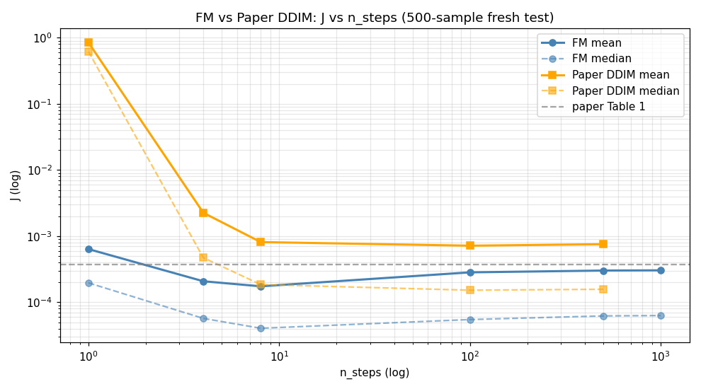
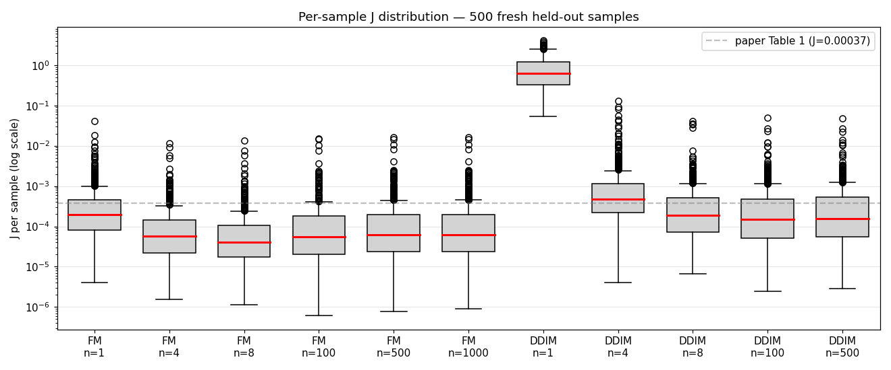
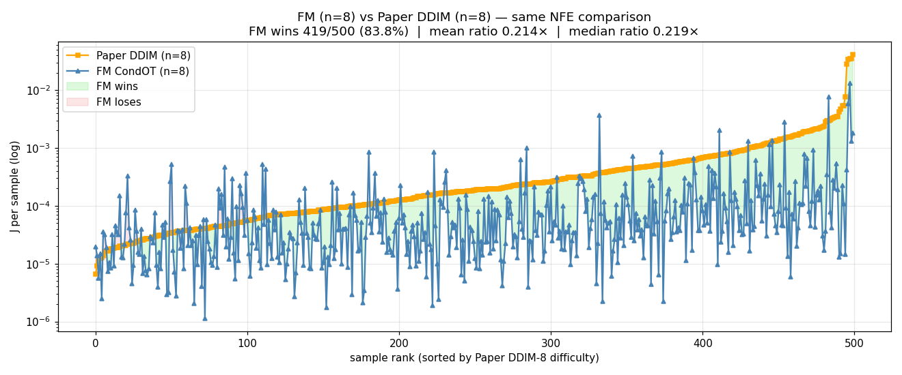
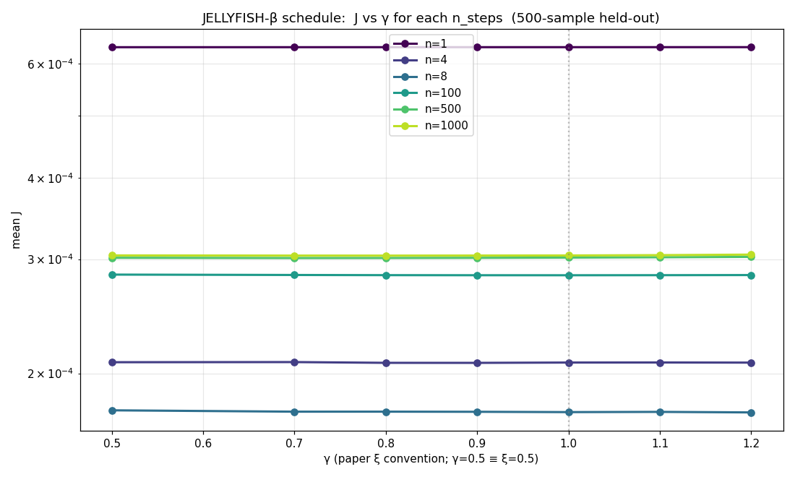
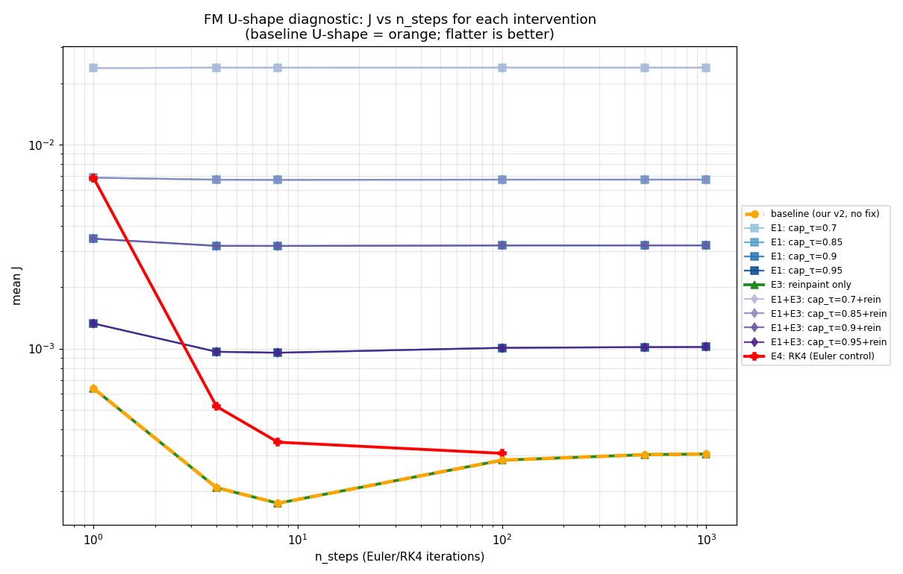
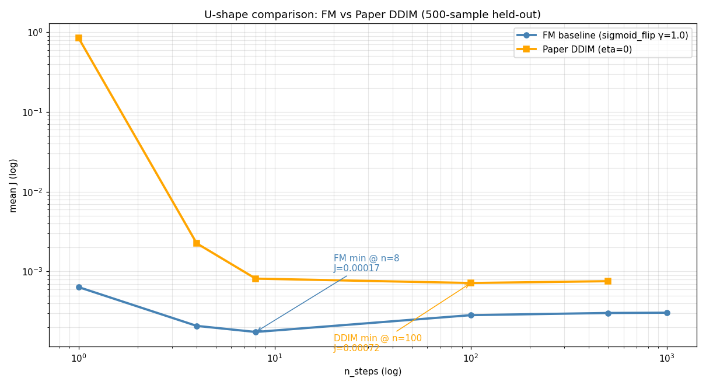
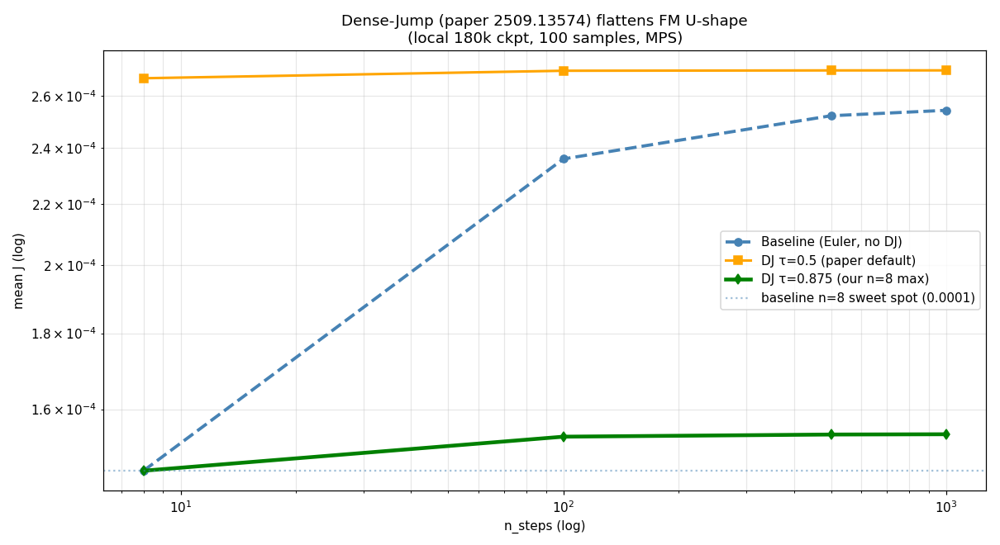

# DiffPhyCon — Reproduction with Flow Matching

Reproduction of [DiffPhyCon (Wei et al, NeurIPS 2024)](https://github.com/AI4Science-WestlakeU/diffphycon), using **Flow Matching (CondOT)** as the generative backbone instead of the paper's DDPM. Flow Matching implementation follows methods from **[MIT 6.S184 — Introduction to Flow Matching and Diffusion Models](https://diffusion.csail.mit.edu/2026/index.html)** (Peter Holderrieth & Ezra Erives, 2026).

Fork of [AI4Science-WestlakeU/diffphycon](https://github.com/AI4Science-WestlakeU/diffphycon). Current scope: **1D Burgers FOPC** (paper's Task 1). 2D Jellyfish and 2D Smoke — ongoing.

---

## Method

Paper uses DDPM to jointly model `p(u, w | c)` where `u` = state trajectory, `w` = control sequence, `c = (u_0, u_T)`. We replace DDPM with **CondOT Flow Matching** (Lipman et al, ICLR 2023, following the formulation in MIT 6.S184 lab notebooks). Architecture, conditioning via boundary inpainting, partial-control masking, and loss masking on `u_0` / `u_T` rows are kept unchanged from the paper.

Sampler: standard Euler integration over `τ ∈ [0, 1]` with `N` steps. For the U-shape investigation we also test RK4, capped-τ Euler, and the Dense-Jump scheme (paper [2509.13574](https://arxiv.org/abs/2509.13574)) which replaces multi-step integration in the high-Lipschitz region near `τ=1` with a single terminal jump.

---

## Results

All evaluations on 500 held-out samples, leak-free test set (`--skip_first 90050`), paper-faithful `burgers_metric` (clears central 50% of `f` then re-solves PDE).

### J vs n_steps (FM vs paper DDIM/DDPM)



Full table:

| Method | n_steps | mean J | median J | Sampling time/sample (A100) |
|:---|---:|---:|---:|---:|
| Paper DDPM | 1000 | 0.001231 | 0.000266 | 8.0 s |
| Paper DDIM | 1000 | 0.001231 | 0.000266 | 7.7 s |
| Paper DDIM | 500 | 0.000756 | 0.000157 | 5.0 s |
| Paper DDIM | 100 | 0.000717 | 0.000152 | 0.06 s |
| Paper DDIM | 8 | 0.000813 | 0.000185 | 0.0014 s |
| Paper DDIM | 4 | 0.002255 | 0.000472 | 0.0009 s |
| Paper DDIM | 1 | 0.847 | 0.617 | 0.0004 s |
| FM (CondOT) | 1 | 0.000637 | 0.000196 | 0.0007 s |
| FM (CondOT) | 4 | 0.000208 | 0.000057 | 0.0025 s |
| **FM (CondOT)** | **8** | **0.000174** | **0.000040** | **0.0047 s** |
| FM (CondOT) | 100 | 0.000283 | 0.000055 | 0.063 s |
| FM (CondOT) | 500 | 0.000302 | 0.000062 | 0.293 s |
| FM (CondOT) | 1000 | 0.000304 | 0.000063 | 0.586 s |

### Per-sample distribution (11 methods, log scale)



### Per-sample paired: FM n=8 vs Paper DDIM n=8 (same NFE)



Same NFE = same wallclock budget. FM wins on 419/500 samples (83.8% paired win rate). Mean J ratio 0.21× (FM 4.7× better). Sorted by Paper DDIM difficulty.

### γ-sweep: jellyfish β schedule



Under the paper's β schedule (sigmoid_beta_schedule with ξ = 1 - γ), γ has near-zero effect: 36/36 (γ, n_steps) cells within ±5% of γ=1.0. Quantitatively confirms paper L.1.

### U-shape in J(n_steps)



11 lines: baseline + 4 cap_τ + reinpaint + 4 cap_τ+reinpaint + RK4. Documents that 4 inference-side hypotheses (cap_τ, reinpaint, RK4, EMA) all fail to fix the U-shape. The root cause is model+integrator, not a bug.

### FM and paper DDIM both have a U-shape; FM's is sharper



U-shape ratio J(n_max)/J(n_min): FM 1.74×, paper DDIM 1.05×.

### Dense-jump flattens the U-shape



Local validation (180k checkpoint, 100 samples, MPS). `--dense_jump_tau 0.875` keeps J at the n=8 sweet spot across n=100/500/1000 (1.06× ratio vs baseline 1.75×). First validation of dense-jump beyond robotic policies.

---

## Files in this fork

### Added

```
flow/burgers_fm_train.py             FM training CLI (dim=128, EMA, cosine LR, paper Table 5 config)
flow/burgers_fm_eval_v2.py           FM eval (γ-sweep, β schedule choice, dense-jump, RK4)
scripts/sweep_500_fresh.sh           Main paper baseline + FM sweep
scripts/sweep_jellyfish_schedule.sh  γ-sweep with paper-faithful jellyfish β
scripts/sweep_ushape_diag.sh         U-shape diagnostic (4 hypothesis tests, 60 cells)
scripts/sweep_dense_jump_parallel.sh Dense-jump sweep on AutoDL (parallel)
scripts/sweep_dense_jump_local.sh    Dense-jump sweep on local Mac
scripts/sweep_baseline_local.sh      Local control for fair DJ comparison
scripts/sweep_raw_weights.sh         EMA vs raw weights ablation
scripts/analyze_500fresh.py          Main results analysis
scripts/analyze_500fresh_gamma.py    γ-sweep analysis
scripts/analyze_jellyfish_vs_sigmoid.py  Schedule comparison
scripts/analyze_ushape_diag.py       U-shape diagnostic analysis
scripts/verify_skip_first.py         Data-leak-free test set verification (5 tests)
scripts/pull_500sweep.sh             AutoDL ↔ local rsync
environment.yml                      Conda env
figures/                             Plots used in this README
```

### Modified

```
dataset/apps/generate_burgers.py     Added --skip_first flag for leak-free test set
```

Everything else under `inference/`, `diffusion/`, `model/`, `dataset/` is unchanged from upstream.

---

## Reproduce

```bash
# Setup
conda env create -f environment.yml
conda activate diffphycon

# Train FM joint model (~12 hours on A100)
python flow/burgers_fm_train.py --variant vanilla --model joint \
    --dim 128 --dim_mults 1 2 4 --num_steps 170000 \
    --dataset free_u_f_paper_fopc --batch_size 16 --lr 1e-4

# Main sweep (paper baseline + FM, ~25 min on A100)
bash scripts/sweep_500_fresh.sh

# γ-sweep with paper-faithful jellyfish β
SKIP_PAPER=1 GAMMAS="0.5 0.7 0.8 0.9 1.0 1.1 1.2" bash scripts/sweep_jellyfish_schedule.sh

# U-shape diagnostic
bash scripts/sweep_ushape_diag.sh

# Dense-jump validation
bash scripts/sweep_dense_jump_parallel.sh    # AutoDL
bash scripts/sweep_dense_jump_local.sh       # local Mac/MPS

# Analysis (plots + tables)
python scripts/analyze_500fresh.py
python scripts/analyze_jellyfish_vs_sigmoid.py
python scripts/analyze_ushape_diag.py
```

---

## Status

1D Burgers FOPC done. Paper's Task 2 (Jellyfish) and Task 3 (Smoke) — ongoing.

---

## Citation

Original DiffPhyCon paper:

```bibtex
@inproceedings{wei2024diffphycon,
  title     = {DiffPhyCon: A Generative Approach to Control Complex Physical Systems},
  author    = {Wei, Long and Hu, Peiyan and Feng, Ruiqi and Feng, Haodong and Du, Yixuan and Zhang, Tao and Wang, Rui and Wang, Yue and Ma, Zhi-Ming and Wu, Tailin},
  booktitle = {NeurIPS},
  year      = {2024}
}
```

Dense-Jump paper (motivating the U-shape investigation):

```bibtex
@misc{densejump2025,
  title         = {Dense-Jump Flow Matching with Non-Uniform Time Scheduling for Robotic Policies: Mitigating Multi-Step Inference Degradation},
  year          = {2025},
  eprint        = {2509.13574},
  archivePrefix = {arXiv}
}
```

---

## License

Same as upstream.
