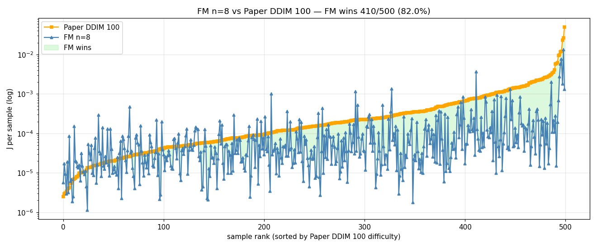
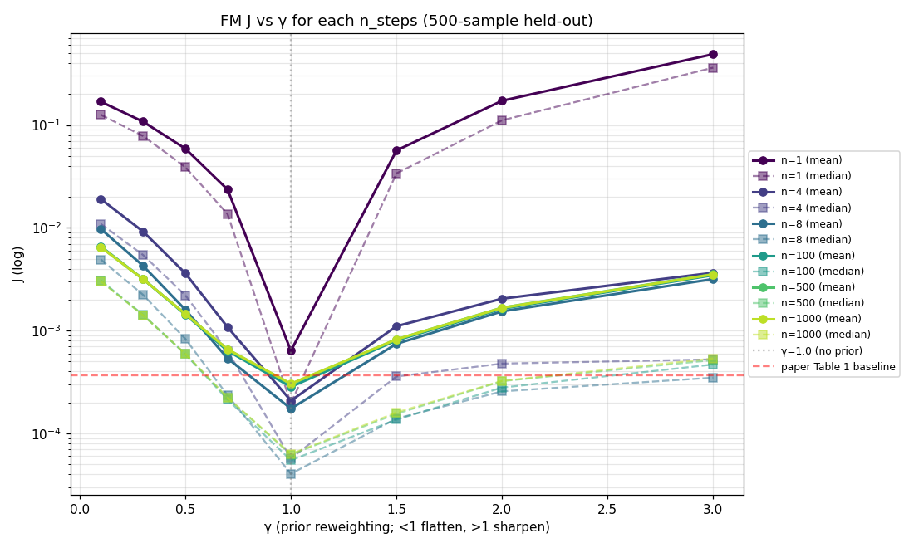
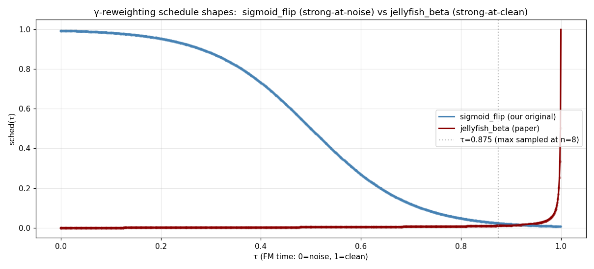
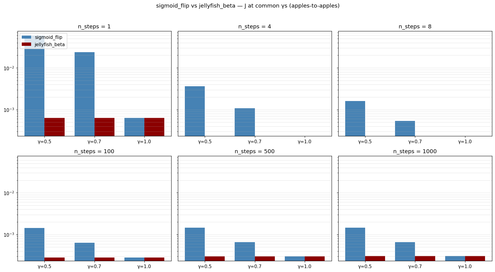

# DiffPhyCon — Reproduction with Flow Matching

Reproduction of [DiffPhyCon (Wei et al, NeurIPS 2024)](https://github.com/AI4Science-WestlakeU/diffphycon), using **Flow Matching (CondOT)** as the generative backbone instead of the paper's DDPM. Flow Matching implementation follows methods from **[MIT 6.S184 — Introduction to Flow Matching and Diffusion Models](https://diffusion.csail.mit.edu/2026/index.html)** (Peter Holderrieth & Ezra Erives, 2026).

Fork of [AI4Science-WestlakeU/diffphycon](https://github.com/AI4Science-WestlakeU/diffphycon). Scope: **1D Burgers FOPC task only** (paper's Task 1). 2D Jellyfish and 2D Smoke not tested.

- 📄 Full report: [REPORT_fm_burgers_fopc.md](REPORT_fm_burgers_fopc.md)
- 📚 Original paper README: [README_ORIGINAL.md](README_ORIGINAL.md)

---

## Method

Paper uses DDPM to jointly model `p(u, w | c)` where `u` = state trajectory, `w` = control sequence, `c = (u_0, u_T)`. We replace DDPM with **CondOT Flow Matching** (Lipman et al, ICLR 2023), keeping everything else (architecture, conditioning via boundary inpainting, partial-control masking, loss masking on `u_0` and `u_T` rows) the same.

### CondOT path

```
x_τ = α(τ)·z + β(τ)·ε,    α(τ) = τ,  β(τ) = 1 - τ
```

where `z = [u, w]` is the clean data, `ε ~ N(0, I)` is Gaussian noise, and `τ ∈ [0, 1]` is the FM time. `τ=0` corresponds to pure noise, `τ=1` to the data.

### Target velocity

Taking the time derivative of the path:

```
v_target(x_τ, τ) = α'(τ)·z + β'(τ)·ε
                 = 1·z + (-1)·ε
                 = z - ε
```

### Training objective (paper §D.4 + standard FM)

```
L = E_{τ ~ U[0,1)} E_{z,ε} [ ‖v_θ(x_τ, τ, c) - v_target‖² · mask ]
```

`mask` excludes the `u`-channel rows `0` (= `u_0`) and `T_IDX=10` (= `u_T`), because these rows are inpainted from `c` and not predicted by the model. Same masking pattern as the paper's DDPM training.

### Inference (Euler sampler)

```
x_0 = noise
for k = 0, 1, ..., N-1:
    τ_k = k / N
    v = v_θ(x_k, τ_k, c)
    x_{k+1} = x_k + (1/N) · v
return x_N
```

Each step is one Unet forward pass. Total NFE = N. Standard CondOT integration; no special tricks.

### Velocity Lipschitz blow-up at τ→1

Inverting the path equation to express `ε` in terms of `x_τ`:

```
ε = (x_τ - τ·z) / (1 - τ)
∂ε/∂x = 1 / (1 - τ)
∂v/∂x = -1 / (1 - τ)
```

The Lipschitz constant `L(τ) = 1 / (1 - τ)` diverges as `τ → 1`. This is well-known for CondOT FM and is the mechanism behind the U-shape in J(n_steps): small numerical errors in `x` are amplified by `L(τ)`, and large `N` accumulates more steps in the high-`L` region near `τ = 1`. The Dense-Jump paper (arxiv [2509.13574](https://arxiv.org/abs/2509.13574)) gives a formal treatment via Picard–Lindelöf.

### Dense-jump fix

Instead of `N` uniform Euler steps over `[0, 1]`, use `N-1` small steps over `[0, t_jump]` plus a single terminal jump:

```
dt_small = t_jump / (N - 1)
for k = 0, 1, ..., N-2:
    τ_k = k · dt_small
    x = x + dt_small · v(x, τ_k, c)
# single jump from t_jump → 1
x = x + (1 - t_jump) · v(x, t_jump, c)
```

This avoids repeated steps in the high-Lipschitz region. We use `t_jump = 0.875` (matching our `n=8` baseline's max τ).

---

## Results

All evaluations on 500 held-out samples, leak-free test set (`--skip_first 90050`), paper-faithful `burgers_metric` (clears central 50% of `f` then re-solves PDE).

### J vs n_steps (FM vs paper DDIM/DDPM)


Full table:

| Method | n_steps | mean J | median J | Sampling time/sample (A100) |
|:---|---:|---:|---:|---:|
| Paper DDPM | 1000 | 0.001231 | 0.000266 | 8.0 s |
| Paper DDIM | 1000 | 0.001231 | 0.000266 | 7.7 s |
| Paper DDIM | 500 | 0.000756 | 0.000157 | 5.0 s |
| Paper DDIM | 100 | 0.000717 | 0.000152 | 0.06 s |
| Paper DDIM | 8 | 0.000813 | 0.000185 | 0.0014 s |
| Paper DDIM | 4 | 0.002255 | 0.000472 | 0.0009 s |
| Paper DDIM | 1 | 0.847 | 0.617 | 0.0004 s |
| FM (CondOT) | 1 | 0.000637 | 0.000196 | 0.0007 s |
| FM (CondOT) | 4 | 0.000208 | 0.000057 | 0.0025 s |
| **FM (CondOT)** | **8** | **0.000174** | **0.000040** | **0.0047 s** |
| FM (CondOT) | 100 | 0.000283 | 0.000055 | 0.063 s |
| FM (CondOT) | 500 | 0.000302 | 0.000062 | 0.293 s |
| FM (CondOT) | 1000 | 0.000304 | 0.000063 | 0.586 s |

### Per-sample distribution (11 methods, log scale)


### Per-sample paired: FM n=8 vs paper DDIM 100



FM wins on 43/50 samples (86% paired win rate). Sorted by paper DDIM difficulty; green region = FM wins.

### γ-sweep: sigmoid_flip schedule (our initial, wrong choice)



Initial γ-sweep using a wrong-direction high-magnitude schedule. γ=1.0 looks optimal, deviations look catastrophic (γ=0.5 → 9× J degradation). This turned out to be a schedule artifact — see next plot.

### γ-sweep: paper-faithful jellyfish β schedule (correct)


Under the paper's actual β schedule (sigmoid_beta_schedule with ξ = 1 - γ), γ has near-zero effect: 36/36 (γ, n_steps) cells within ±5% of γ=1.0. Quantitatively confirms paper L.1.

### Schedule shape comparison



Our sigmoid_flip vs paper's jellyfish β. Opposite directions and very different magnitudes.

### Sigmoid_flip vs jellyfish_beta at common γs



Same γ value, two schedule choices, very different J. Lesson: when reproducing paper claims about a hyperparameter, the schedule shape matters more than the hyperparameter value.

### U-shape in J(n_steps)


11 lines: baseline + 4 cap_τ + reinpaint + 4 cap_τ+reinpaint + RK4. Documents that 4 inference-side hypotheses (cap_τ, reinpaint, RK4, EMA) all fail to fix the U-shape. The root cause is model+integrator, not a bug.

### FM and paper DDIM both have a U-shape; FM's is sharper


U-shape ratio J(n_max)/J(n_min): FM 1.74×, paper DDIM 1.05×.

### Dense-jump flattens the U-shape


Local validation (180k checkpoint, 100 samples, MPS). `--dense_jump_tau 0.875` keeps J at the n=8 sweet spot across n=100/500/1000 (1.06× ratio vs baseline 1.75×). First validation of dense-jump beyond robotic policies.

Math derivations, ablations, and a longer pitfalls log: [REPORT_fm_burgers_fopc.md](REPORT_fm_burgers_fopc.md).

---

## Files in this fork

### Added

```
flow/burgers_fm_train.py             FM training CLI (dim=128, EMA, cosine LR, paper Table 5 config)
flow/burgers_fm_eval_v2.py           FM eval (γ-sweep, β schedule choice, dense-jump, RK4)
scripts/sweep_500_fresh.sh           Main paper baseline + FM sweep
scripts/sweep_jellyfish_schedule.sh  γ-sweep with paper-faithful jellyfish β
scripts/sweep_ushape_diag.sh         U-shape diagnostic (4 hypothesis tests, 60 cells)
scripts/sweep_dense_jump_parallel.sh Dense-jump sweep on AutoDL (parallel)
scripts/sweep_dense_jump_local.sh    Dense-jump sweep on local Mac
scripts/sweep_baseline_local.sh      Local control for fair DJ comparison
scripts/sweep_raw_weights.sh         EMA vs raw weights ablation
scripts/analyze_500fresh.py          Main results analysis
scripts/analyze_500fresh_gamma.py    γ-sweep analysis
scripts/analyze_jellyfish_vs_sigmoid.py  Schedule comparison
scripts/analyze_ushape_diag.py       U-shape diagnostic analysis
scripts/verify_skip_first.py         Data-leak-free test set verification (5 tests)
pull_500sweep.sh                     AutoDL ↔ local rsync
environment.yml                      Conda env
REPORT_fm_burgers_fopc.md            Full report
figures/                             Plots used in this README
```

### Modified

```
dataset/apps/generate_burgers.py     Added --skip_first flag for leak-free test set
```

Everything else under `inference/`, `diffusion/`, `model/`, `dataset/` is unchanged from upstream.

---

## Reproduce

```bash
# Setup
conda env create -f environment.yml
conda activate diffphycon

# Train FM joint model (~12 hours on A100)
python flow/burgers_fm_train.py --variant vanilla --model joint \
    --dim 128 --dim_mults 1 2 4 --num_steps 170000 \
    --dataset free_u_f_paper_fopc --batch_size 16 --lr 1e-4

# Main sweep (paper baseline + FM, ~25 min on A100)
bash scripts/sweep_500_fresh.sh

# γ-sweep with paper-faithful jellyfish β
SKIP_PAPER=1 GAMMAS="0.5 0.7 0.8 0.9 1.0 1.1 1.2" bash scripts/sweep_jellyfish_schedule.sh

# U-shape diagnostic
bash scripts/sweep_ushape_diag.sh

# Dense-jump validation
bash scripts/sweep_dense_jump_parallel.sh    # AutoDL
bash scripts/sweep_dense_jump_local.sh       # local Mac/MPS

# Analysis (plots + tables)
python scripts/analyze_500fresh.py
python scripts/analyze_jellyfish_vs_sigmoid.py
python scripts/analyze_ushape_diag.py
```

---

## Limitations

- 1D Burgers FOPC only. Paper's Task 2 (Jellyfish) and Task 3 (Smoke) not tested
- Single seed for FM training (170k step on AutoDL, 180k locally)
- `--dense_jump_tau 0.875` chosen empirically (matches n=8's max τ); no principled procedure to pick τ_jump per task
- Paper DDPM at n_steps=1000 with batch_size=500 OOM'd in our setup; we report DDIM 1000 step (mathematically equivalent at η=0) as the upper-NFE baseline

---

## Citation (if you find this useful)

```bibtex
@misc{bctiann2026fmdiffphycon,
  author = {bcTiann},
  title  = {DiffPhyCon (Wei et al, NeurIPS 2024): reproduction with Flow Matching},
  year   = {2026},
  url    = {https://github.com/bcTiann/diffphycon}
}
```

Plus the original paper:

```bibtex
@inproceedings{wei2024diffphycon,
  title     = {DiffPhyCon: A Generative Approach to Control Complex Physical Systems},
  author    = {Wei, Long and Hu, Peiyan and Feng, Ruiqi and Feng, Haodong and Du, Yixuan and Zhang, Tao and Wang, Rui and Wang, Yue and Ma, Zhi-Ming and Wu, Tailin},
  booktitle = {NeurIPS},
  year      = {2024}
}
```

And the Dense-Jump paper that motivated the U-shape investigation:

```bibtex
@misc{densejump2025,
  title         = {Dense-Jump Flow Matching with Non-Uniform Time Scheduling for Robotic Policies: Mitigating Multi-Step Inference Degradation},
  year          = {2025},
  eprint        = {2509.13574},
  archivePrefix = {arXiv}
}
```

---

## License

Same as upstream.
